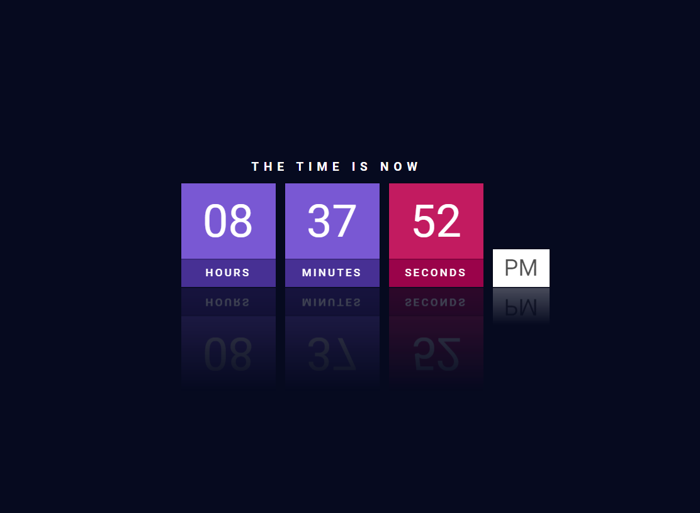

<h1 align="center"> Clock UI Design </h1>

  

  &nbsp;&nbsp;&nbsp;|&nbsp;&nbsp;&nbsp;
      <a href="#-project">Project</a>&nbsp;&nbsp;&nbsp;|&nbsp;&nbsp;&nbsp;
  <a href="#-techs">Techs</a>&nbsp;&nbsp;&nbsp;|&nbsp;&nbsp;&nbsp;

  

 

## 👩🏻‍💻 Project

Digital watch using HTML CSS & JavaScript

[🔗 You can access the site by clicking here 🕑](https://codepen.io/fernandadiasm/pen/PodGgWP)

## 🚀 Techs

This project was developed with the following technologies:

- HTML  
- CSS
- JavaScript

---
#### Made with ♥ by Fernanda Dias

  

